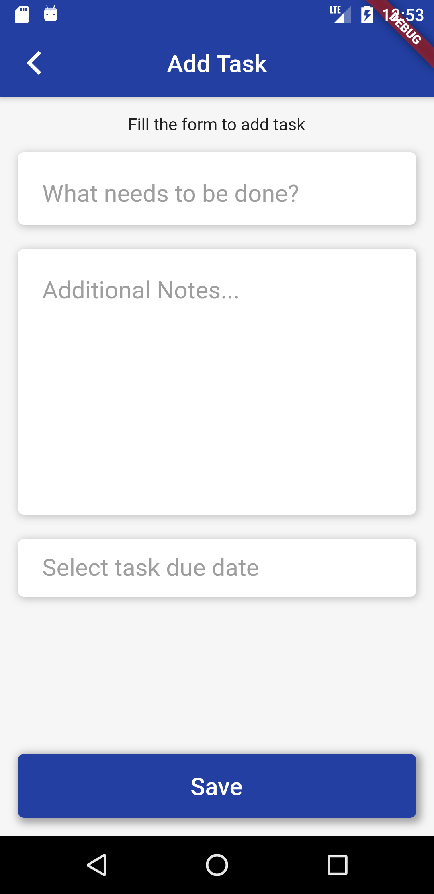
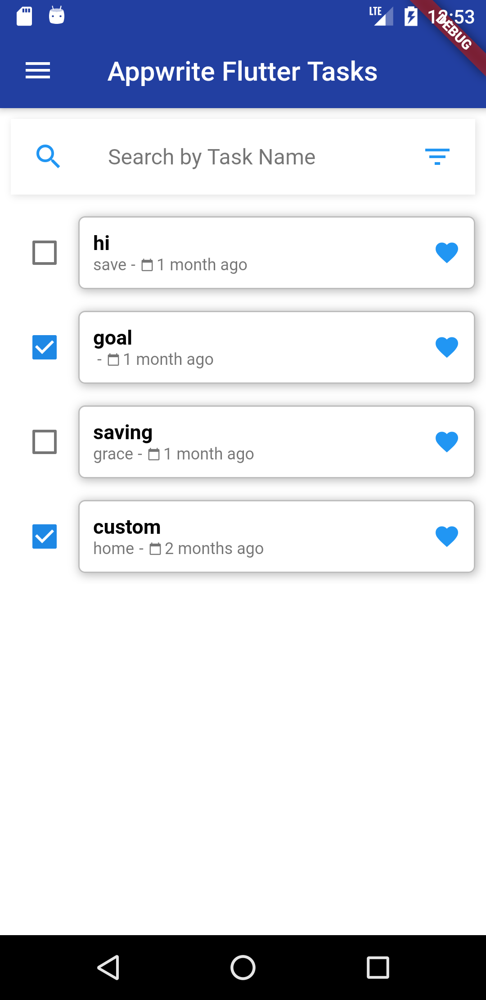
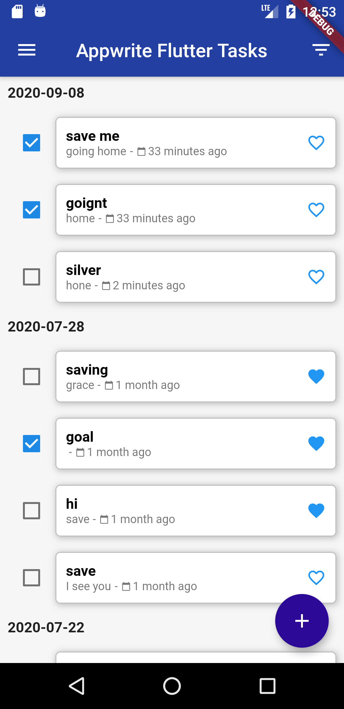

<p  align="center">
<a  href="https://flutter.dev"  target="_blank"></a> <a>&nbsp;&nbsp;&nbsp;</a>
<a  href="https://appwrite.io"  target="_blank"></a>

</p>

# Appwrite-Todo

A functional flutter Todo app designed appwrite with minimal features, just enough to help you do your tasks.

## Why Appwrite

Appwrite is an end-to-end backend server that is aiming to abstract the complexity of common, complex, and repetitive tasks required for building a modern app.

Appwrite provides you with a set of APIs, tools, and a management console UI to help you build your apps a lot faster and in a much more secure way.

## Features

- Build on [**BLoC**](https://pub.dev/packages/flutter_bloc) Architecture Pattern
- Reactive Programming
- Sign up by [**Registering**](#registration) inputting email and password
- Enter email and password to [**Login**](#login)
- Add [**Tasks**](#task) to create new task
- Click [**Complete**](#complete-task) to complete a task
- Click [**Favourite**](#favourite-task) to add a task as favourite
- [**Swipe**](#swipe-the-task) to delete the task
- View [**All Task**](#all-task)
- View [**Completed Task**](#completed-task)
- View [**Favourite Task**](#view-favourite-task)

## Screenshots



## Demo


## Installation

### Appwrite

Appwrite backend server is designed to run in a container environment. Running your server is as easy as running one command from your terminal. You can either run Appwrite on your localhost using docker-compose or on any other container orchestration tool like Kubernetes, Docker Swarm or Rancher.

The easiest way to start running your Appwrite server is by running our docker-compose file. Before running the installation command make sure you have [Docker](https://www.docker.com/products/docker-desktop) installed on your machine:

### Unix

```bash
docker run -it --rm \
    --volume /var/run/docker.sock:/var/run/docker.sock \
    --volume "$(pwd)"/appwrite:/install/appwrite:rw \
    -e version=0.6.2 \
    appwrite/install
```

### Windows

#### CMD

```cmd
docker run -it --rm ^
    --volume //var/run/docker.sock:/var/run/docker.sock ^
    --volume "%cd%"/appwrite:/install/appwrite:rw ^
    -e version=0.6.2 ^
    appwrite/install
```

#### PowerShell

```powershell
docker run -it --rm ,
    --volume /var/run/docker.sock:/var/run/docker.sock ,
    --volume ${pwd}/appwrite:/install/appwrite:rw ,
    -e version=0.6.2 ,
    appwrite/install
```

Once the Docker installation completes, go to http://localhost to access the Appwrite console from your browser. Please note that on non-linux native hosts, the server might take a few minutes to start after installation completes.

For advanced production and custom installation, check out our Docker [environment variables](docs/tutorials/environment-variables.md) docs. You can also use our public [docker-compose.yml](https://appwrite.io/docker-compose.yml) file to manually set up and environment.

#### Setting up appwrite project

### Flutter

To build and run this project:

1. Get Flutter [here](https://flutter.dev) if you don't already have it
2. Clone this repository
3. `cd` into the repo folder
4. run `flutter run-android` or `flutter run-ios` to build the app

(Please note that a Mac with XCode is required to build for iOS)


